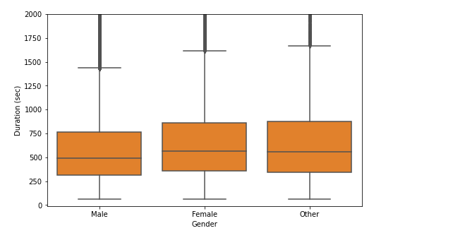

# Découverte et mise en œuvre de Spark

    ##Lecture de données

Après téléchargement des données du lien : https://s3.amazonaws.com/baywheels-data/201802-fordgobike-tripdata.csv.zip, nous avons crée la table "201902_fordgobike_tripdata" depuis le notebook dans databricks.

nous avons changé le schéma de données pour que les colonnes duration_sec soit un entier, start_time et end_time soient du type datetime.

    ##Structure des données

Dans notre dataset, nous avons 183412 fordgobike trips avec 16 colonnes (duration_sec, start_time, end_time, start_station_id, start_station_name, start_station_latitude, start_station_longitude, end_station_id, end_station_name, end_station_latitude ,end_station_longitude, bike_id, user_type, member_birth_year, member_gender, bike_share_for_all_trip). 9 de ces dernières sont numeriques, 2 sont des datetime, 4 de type objet et 1 qui est de type boolien.

    ##Analyse et visualisation des données

Dans cette partie, nous sommes intéressé à comprendre comment la durée du voyage (duration_sec) dépend d'autres spécifications de l'ensemble de données. nous nous attendons à ce que la durée du trajet dépende fortement des stations de départ et des stations d'arrivée, les endroits plus encombrés devraient recevoir plus de trajets, donc certaines stations devraient enregistrer plus de durée. Nous pensons également que user_type, birthyear et gender devraient également affecter la durée du voyage.

    ###A. Exploration Univariante

Nous allons commencer par regarder la distribution de la principale variable d'intérêt : duration_sec.

Regardons maintenant la distribution des stations de départ et d'arrivée

Nous constations que les mêmes sont plus fréquentes en tant que stations de départ et d'arrivée.

Nous allons voir ici la distribution d'age, leur type et leur sexe.

On voit que la distribution est plus concentrée entre 20 et 40 ans.

La majorité des utilisateurs sont des abonnés.

    ###B. Exploration Bivariante

Examinons d'abord la corrélation entre la durée du voyage et l'âge.

Comme la plupart des durées sont inférieures à 6000 et que l'âge est inférieur à 80, recadrons pour mieux visualiser.

En observant, on peut dire que les utilisateurs les plus fréquents de vélos ont entre 20 et 45 ans. Les plus jeunes ont une durée plus élevée.

Examinons maintenant la dépendance de la durée entre la station de départ et la station d'arrivée.

En regardant ces tracés, vous pouvez voir que la durée du trajet pour certaines stations en tant que station de départ est plus élevée et pour certaines stations en tant que station d'arrivée est plus élevée. Par cela, nous pouvons voir que quelles stations entraînent le début de trajets plus longs et quelles stations terminent des trajets plus longs.

Examinons maintenant la dépendance des durées de voyage en fonction du sexe et du type de l'utilisateur.

Bien que la quantité de utilisateurs masculins soit très élevée par rapport aux autres et aux femmes, nous pouvons voir qu'un pourcentage plus élevé de femmes et d'autres font des trajets plus longs que les hommes.

    ###C. Exploration Multivariante
La principale chose que nous souhaitons explorer dans cette partie de l'analyse est de savoir comment les deux mesures catégoriques, le sexe et le type d'utilisateur, jouent dans la relation entre la durée du voyage et l'âge.

Ce graphique ne montre pas une image claire, séparons donc les 3 valeurs du sexe dans des graphes différents.

On assiste ici à une augmentation de durée pour d'autres à un âge plus avancé (autour de 60 ans).

Dans ce tp, nous avons observé que, bien que le nombre de voyages de plus longue durée soit plus élevé pour les hommes, mais que le pourcentage soit plus élevé pour les femmes et les autres, d'autres ont également un pic de plus à près de 60 ans pour une durée plus longue. Pour différents types d'utilisateurs, les deux affichent des tendances similaires pour l'âge et la durée du voyage. Mais il y a une légère inclinaison vers un âge plus élevé pour les abonnés ayant une meilleure durée de voyage.